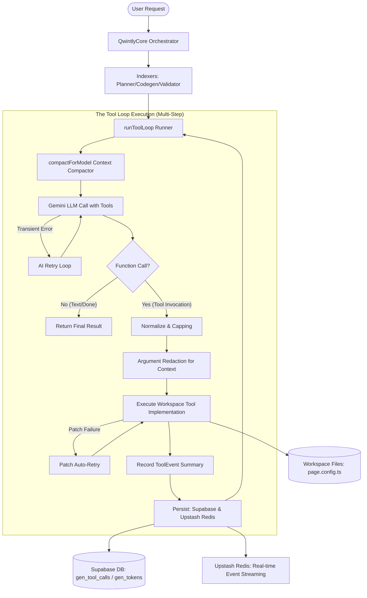

# ⚙️ Qwintly Core: Architecture, Tooling, & Context Orchestration Reference

Welcome to the definitive architecture and technical reference documentation for **Qwintly Core** (`qwintly-core`). This document details the inner workings of the AI agent core engine that drives the automated planner and codegen capabilities of the Qwintly website generator.

---

## 🗺️ High-Level System Architecture

Qwintly Core acts as the orchestrator connecting the Gemini Large Language Model (LLM), the client website workspace, and the persistence layers (Supabase database and Upstash Redis). It operates via a structured, multi-turn **Tool Loop** (`runToolLoop`) optimized for token efficiency, safety, and real-time execution visibility.



---

## 🛠️ The Tool Ecosystem

Tools in Qwintly Core are designed with a strict separation of concerns, dividing the declarations (Schemas) from the execution (Implementations).

*   **Schemas (`src/ai/tools/schemas/`)**: Define the JSON-Schema descriptions of function arguments, parameters, and descriptions used by Gemini for tool selection.
*   **Implementations (`src/ai/tools/implementations/`)**: Houses the workspace-level side-effects (file reads/writes, folder listings, element trees, CSS/styles manipulation, etc.).
*   **Factories (`src/ai/tools/implementations/factories.ts`)**: Binds workspace environments (dependencies like file systems and project directories) dynamically.

### 📦 Categorized Toolsets

The engine divides execution into two discrete phases, restricting model permissions via customized **toolsets** to maintain focus and security.

| Phase / Toolset | Allowed Tools | Purpose |
| :--- | :--- | :--- |
| **Planner Phase** (`plannerTools`) | `read_file`, `search`, `list_dir`, `get_available_routes`, `submit_planner_tasks` | Investigates project layouts, performs code/asset research, and outputs a concrete implementation checklist. |
| **Codegen Phase** (`codegenTools`) | `read_file`, `update_global_styles`, `create_new_route`, `modify_element`, `get_available_routes`, `submit_codegen_done` | Executes structural modifications, manipulates UI components/layouts, updates design tokens, and finalizes edits. |

---

### 🛡️ Specialized Tool Implementation Highlights

#### 1. `read_file` (Auto-Capped Reader)
Supports reading a specific line range (`start_line` to `end_line`). If no range is specified or if the requested range is excessively large, it automatically applies context capping (default: 200 lines) to prevent runaway token usage.

#### 2. Styling & Structural Manipulation Tools
*   `update_global_styles`: Flat-key styling modifier targeting global configuration tokens (like background, foreground colors, borders, font weights) stored in the workspace's styling file.
*   `modify_element`: Declaratively manages elements within page configurations, supporting actions to `insert`, `delete`, `update_classname`, or `update_props`, ensuring strict structural changes without direct code rewriting.

---

## 🔄 The `toolLoop` Execution Flow

The tool loop handles the turn-by-turn conversation lifecycle. A single turn consists of:

1.  **Context Optimization**: The current conversational thread is analyzed and compacted based on strict size and message constraints (`compactForModel`).
2.  **Model Turn**: The compacted history is transmitted to Gemini via `aiCallWithRetry`, supporting up to 3 automatic retries in case of transient API failures or high-load throttling.
3.  **Function Processing**:
    *   If the model returns a **text answer**, the loop halts, and the final response is delivered.
    *   If the model returns **function calls** (tools):
        *   **Normalization**: Inputs are normalized (e.g. converting string line bounds into real integers).
        *   **Logging**: A user-friendly message is constructed and broadcasted to the frontend indicating the tool's immediate action.
        *   **Execution**: The appropriate workspace implementation handler runs.
        *   **Event Summarization**: The outcome is saved as a `ToolEvent` to compile high-level summarization.
        *   **DB Persistence**: The tool parameters and outputs are logged to the database.
4.  **Terminal Check**: If the executed tool matches the target stage's completion trigger (e.g. `submit_codegen_done` or `submit_planner_tasks`), the loop terminates. Otherwise, it carries the modifications back to Step 1.

---

## 🧠 Smart Context Management in Tool Calls

A recurring challenge with complex agent loops is context-window bloat caused by reading multiple files. Qwintly Core addresses this with an aggressive compression policy:

### 1. Conversational Compaction & Summarization (`compactForModel`)
The history compaction operates on a strict budget (`maxModelChars`, default: 120,000 characters).
*   **Recent Conversation Window**: It always preserves the most recent `tailMessages` (default: 8 turns) verbatim to ensure the model understands immediate instruction changes and errors.
*   **Memory Summarization**: Older tool calls outside this window are completely stripped. In their place, a single, highly compressed context block is injected:
    ```text
    MEMORY (tool trace summary):
    - read_file app/styleConfig.json:1-120 (capped)
    - update_global_styles success tokens=background,foreground version=2 changed=true
    ```
    This is compiled dynamically from the `ToolEvent` registry recorded during step executions.
*   **Older Message Pruning**: If the history size still exceeds character limits, it iteratively cuts older turns from the workspace's early initialization trace, ensuring the core context never overflows.

---

## 💾 Model Output & Tool Call Persistence

To guarantee full traceability, auditability, and real-time observability, Qwintly Core persists every facet of model interactions:

```
                            [ Qwintly Core Orchestrator ]
                                         │
       ┌─────────────────────────────────┼─────────────────────────────────┐
       ▼                                 ▼                                 ▼
[ gen_tool_calls ]                 [ gen_tokens ]                  [ status_messages ]
(Supabase DB Table)              (Supabase DB Table)             (PostgreSQL & Redis PubSub)
 ├─ sessionId (gen_id)            ├─ sessionId (gen_id)           ├─ Chat ID / Session ID
 ├─ tool_call_name                ├─ model_name                   ├─ Event Type / Step
 ├─ tool_params (redacted)        ├─ input_tokens                 └─ Streamed Log Output
 └─ tool_final_output             └─ output_tokens                   (Real-time Progress)
```

### 1. Tool Call Logging (`gen_tool_calls`)
Every single tool execution is tracked in the Supabase database. During initialized execution, the `GenToolCallsRepository` records:
*   `gen_id`: Represents the current session/generation ID.
*   `tool_call_name`: The name of the tool (e.g. `update_props`).
*   `tool_params`: The sanitized, normalized, and redacted argument schema.
*   `tool_final_output`: The precise structured JSON response returned by the implementation.

### 2. Token Auditing & Financials (`gen_tokens`)
To monitor execution cost and token metrics:
*   Input and Output tokens are accumulated during each API call using raw headers provided by Gemini.
*   Upon tool loop completion (success or error), the aggregated input and output tokens are committed to Supabase via `GenTokensRepository` under the session ID, logging the exact model identifier (e.g., `gemini-1.5-pro` / `gemini-1.5-flash`).

### 3. Real-Time Status & Event Streaming (`status_messages`)
To feed live frontend web consoles or progress indicators:
*   Qwintly Core utilizes `streamLog` to broadcast live execution status.
*   Logs are concurrently sent in two directions:
    1.  **Supabase PostgreSQL (`gen_status` table)**: Acts as a permanent historical log trace of the session.
    2.  **Upstash Redis Pub/Sub**: Published instantly to feed low-latency UI consoles (e.g. displaying "AI tool: Creating new route '/blog'").
*   Events are tagged with specialized types (e.g. `STEP_STARTED`, `STEP_COMPLETED`, `STEP_ERROR`) to drive interactive UI animations.
